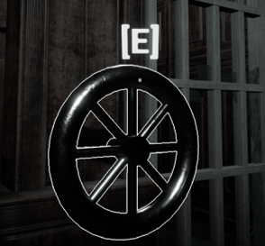
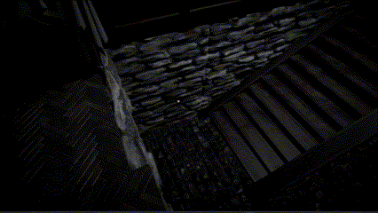

# Hallucination

**_2023, Team Get High Presents_**

_@2023-2, Prof. H. Kang, KHU Department of Software Convergence, SWCON212 Game Engine Basics_

## 게임 소개
### 시놉시스  
  > 급작스레 쏟아지는 비.  
    남자는 비를 피해 버려진 저택으로 쫒기듯 숨었다.  
    ...그러지 않은 것이 좋았을텐데 말이다.  
    괴물을 피해 저택 밖으로 탈출하라!

Hallucination은 괴물을 피해 저택에서 탈출하는 호러 스텔스 게임입니다. 저택에는 눈이 멀었지만 귀와 코가 아주 예민한 괴물이 돌아다니고 있습니다. 당신은 괴물을 유인하거나, '특별한 능력'을 사용해서 저택의 퍼즐들을 풀어나가야 합니다. 행운을 빕니다.

### Midterm Trailer  
[Watch on Youtube](https://www.youtube.com/watch?v=oOxi5Nnza6c)  

### Final Trailer  
[Watch on Youtube](https://www.youtube.com/watch?v=SPiqvQ5tQQ0)  

### 개발자 코멘터리
[Watch on Youtube](https://www.youtube.com/watch?v=V5y_72RbT6Y)  

## 게임 특징
### Dynamic Gravity와 3D Navigation Mesh를 활용한 입체적인 레벨 디자인
Hallucination의 핵심적인 시스템 중 하나는 Dynamic Gravity입니다. 당신은 중력을 조작할 수 있는 능력을 가져 천장에 붙어있는 물체를 땅으로 가져오거나, 천장에 붙어 이동하는 등의 행동을 할 수 있습니다. 이러한 Dynamic Gravity 시스템은 게임이 진행되는 공간을 2차원 평면에서 3차원 입체 공간으로 확장시키는 역할을 수행합니다.  

입체로 구성된 레벨은 시각적 측면에서는 흥미로운 장면을 선사하며, 플레이 측면에서는 평면과는 다른 방식의 새로운 접근을 플레이어에게 요구합니다. 공포 게임에서 플레이어만 천장과 바닥을 오르내릴 수 있다면 천장은 안전한 공간이 되어 긴장감을 떨어트릴 것입니다. 그러나 기존의 Nav Mesh는 바닥 평면에서의 AI 이동만 처리할 수 있다는 문제점이 있습니다. 때문에 Hallucination은 천장과 바닥 모두에서 사용할 수 있는 새로운 3D Nav Mesh를 도입하여 천장과 바닥 모두에서 괴물이 플레이어를 쫒아오는 상황을 구현하였습니다. 

Dynamic Gravity와 3D Nav Mesh를 통해 평면에서만 진행되는 게임에서는 시도할 수 없는 입체적인 레벨 디자인을 도입할 수 있었습니다. 이러한 입체적인 레벨 디자인은 Hallucination을 플레이하는 여러분들께 완전히 새로운 경험을 제공할 수 있을 것입니다.

### 청각을 활용한 적극적인 잠입 요소
기존의 잠입 요소들은 적의 시야를 피해서 목적지에 도달하는 형식의 구성이 대부분이었습니다. Hallucination은 시각 대신 청각을 이용하는 잠입 요소를 제작하여 플레이어에게 색다른 경험을 제공하고자 했습니다.  

  

청각을 활용한 잠입 요소가 시각에 의존하는 잠입과 비교해서 가지는 특징은 보다 플레이어가 적극적으로 잠입을 진행할 수 있다는 점입니다. 더이상 플레이어에게 잠입은 '시야에서 숨는 것'이 아닙니다. 플레이어는 숨어다니는 대신 일부러 소리를 발생시켜 괴물을 특정 장소로 유인하여 가두는 등의 플레이가 가능해집니다. 비교적 능동적으로 플레이를 진행할 수 있다는 것입니다.

  

이처럼 꼭 시각을 사용하지 않고서도 충분히 잠입 게임은 성립할 수 있습니다. Hallucination에서는 돌릴 때 소리가 나는 벨브를 도입하여 괴물이 플레이어의 행동을 인지할 수 있도록 만들었습니다. 클리어를 위해서는 괴물을 어떤 방법으로 가둔 다음에 벨브를 돌려 괴물이 플레이어에게 접근 할 수 없도록 만들어야 합니다.

### 자연스럽게 게임을 즐길 수 있는 완만한 학습 곡선
플레이어에게 많은 정보를 숨기는 호러 장르의 특성상 지나치게 친절한 튜토리얼은 오히려 독이 됩니다. 하지만 지나치게 불친절한 튜토리얼 역시 게임의 UX를 해치는 요인으로 작용합니다. 때문에 Hallucination은 의식적으로 학습을 진행해야하는 튜토리얼은 최소화 하되, 게임을 진행하는 과정에서 자연스럽게 게임의 규칙을 학습할 수 있도록 UX/UI를 디자인 하였습니다.

    
    

위와 같이 상호작용 할 수 있는 물체에 사용 가능한 키를 띄워주어 플레이어가 키를 외워야 하는 부담을 줄였습니다. 추가로 아래와 같이 게임 진행의 핵심이 되는 정보들은 자막을 통해 전달하여 사용자가 쉽게 정보를 인지할 수 있습니다.

또한 처음부터 모든 기능을 개방해두지 않고 게임을 진행하며 서서히 새로운 능력을 학습하도록 레벨을 설계하여 학습 난이도를 완만하게 유지했습니다. 이러한 접근을 통해 플레이어는 자신이 사용 가능한 기능과 등장하는 기믹들에 대해 충분히 이해한 후에 본격적으로 게임이 진행되는 스테이지에 진입하게 됩니다.  

예를 들어 게임의 핵심 기믹 중 하나인 Dynamic Gravity는 처음 게임을 시작했을 때에는 사용할 수 없습니다. 게임을 진행하는 과정에서 플레이어는 능력을 획득하게 되고, 이를 활용하여 해결할 수 있는 아주 간단한 퍼즐을 해결하여 Stage2에 진입할 수 있습니다. 그 후에야 해당 스테이지에서 Dynamic Gravity를 본격적으로 활용하게 됩니다. 

# Download
Hallucination은 Windows 환경만을 지원합니다.

## [Windows](https://github.com/Seo-BJ/Hallucination_GetHigh/releases/latest)   
[다운로드](https://github.com/Seo-BJ/Hallucination_GetHigh/releases/latest)  
1. zip 파일 다운로드 후 압축 해제
1. Hallucination.exe 실행

# How To Play

## 조작
* WASD: 이동
* Shift: 달리기
* E: 상호작용(벨브 돌리기, 레버 작동, 문 열기, 아이템 획득 등)
* 좌클릭: 물체 들기 or 밀고 당기기
    * 물체 들기  
        
        * 물체 들고 있는 상태에서 좌클릭: 물체 놓기
        * 물체 들고 있는 상태에서 우클릭: 물체 조준, 다시 클릭하면 던지기
  * 밀고 당기기  
          
        * 물체 잡은 상태에서 앞/뒤로 이동하여 물체 밀고 당기기
* C(능력 획득 필요): 플레이어 중력 반전  
    
* R(능력 획득 필요): 사물 중력 반전  
    

## 퍼즐
* 벨브  
    
    * 끝까지 돌려야 잠겨있는 문을 열 수 있습니다.
    * 돌리는 내내 큰 소리를 발생시키니 주의하세요!
    * 손잡이가 빠져있는 경우 어딘가에 놓인 손잡이를 E로 습득한 후 벨브 실린더와 상호작용 하면 손잡이를 장착할 수 있습니다.

* 레버  
    
    * 잠긴 문을 열거나, 열려있는 문을 잠글 수 있습니다.
    * 잠긴 문은 괴물이라고 해도 열기 힘들걸요?
    * 손잡이가 없는 레버가 발견되기도 합니다. 벨브의 경우와 같이 손잡이를 찾아서 상호작용 하세요.

* 스위치 & 동상  
      
    * 감압식 스위치입니다. 동상을 올려두면 스위치가 작동하여 문이 열립니다.
    * 때론 두 개 이상의 스위치를 작동시켜야 문이 열리기도 합니다.

# 스테이지 구성
1. 인트로 & 튜토리얼
1. Stage1
    - 귀가 밝은 눈 먼 괴물이 스테이지를 돌아다닙니다. 일부러 소리를 내서 적을 유인 할 수 있겠군요?
    - 벨브를 돌려 열 수 있는 철창 너머에 다음 스테이지로 갈 수 있는 열쇠가 있습니다...
    - 벨브를 돌리면 큰 소리가 나서 적이 당신에게 달려옵니다. 그냥은 벨브를 돌릴 수 없어요. 방법을 찾아야 합니다...
1. Stage2
    - 당신은 중력을 반전시키는 능력을 얻고 새로운 스테이지에 도달합니다.
    - 이제 적은 당신의 냄새를 알고 있습니다. 여전히 눈은 보이지 않지만 당신을 천천히, 계속해서 쫒아올겁니다...
    - 스위치와 스위치에 올려둘 수 있는 동상을 찾아 괴물에게 잡히기 전에 방에서 탈출하세요.
    - 스위치는 하나만 있지 않습니다. 그리고 괴물도 마찬가지죠...
1. Stage???
1. 엔딩

## 공략
*주의: 공략을 보고 게임을 클리어 하는 경우 의도된 재미를 온전히 느끼지 못할 수 있습니다. 최대한 공략을 보지 않고 게임을 클리어 하는 것을 추천드립니다.*
1. [Stage-1](./Solution.md#stage-1)
1. [Stage-2](./Solution.md#stage-2)

# About Us
* [**서범준**](https://github.com/Seo-BJ)  

    _팀장, Enemy, 총괄디렉팅, Enemy-1, Stage1, 사운드_  

    > 수학과에서 건너온 세상에서 제일 까다로운 INTJ  

* [**하재준**](https://github.com/How0515)  
    _팀원, Enemy, Enemy-2, Stage2, Stage???, 범용 AI 길찾기_

* [**박지인**](https://github.com/nagi0101)  
    
    
    _팀원, Player, Dynamic Gravity, Post Process(player camera), Save System, Packaging_  
    
    > 철학과에서 소프트웨어융합학과 게임트랙을 다전공 하고있는 낭만파 개발자. 컴퓨터 그래픽스에 관심이 많다. 세상에 몇 명 없는 사람 좋아하는 INTP.

    > 최근 자신의 캐치프레이즈를 무엇으로 정할지 고민중이다. 아래는 그가 후보군으로 두고 있는 자신의 캐치프레이즈이다.  
    >   1. 낭만파 프로그래머 (원래 쓰던 캐치프레이즈)
    >   1. 공리주의 프로그래머
    >   1. 이 시대의 융합형 인재

* [**최홍송**](https://github.com/bubbletok)  
    _팀원, Player, Interaction, UI, Packaging_

* [**김정훈**](https://github.com/q910389942)  
    _팀원, World, 에셋 탐색, 월드 디자인_

* [**문호성**](https://github.com/sim2han)  
    _팀원, World, 레벨 디자인, 월드 디자인, 엔딩 제작_

# License
Hallucination is licensed under the MIT License. See [LICENSE.txt](./LICENSE.txt) for detail.

# Miscellaneous
## Bug Report
버그 제보는 [Issue](https://github.com/Seo-BJ/Hallucination_GetHigh/issues) 페이지를 이용 부탁드립니다:)
